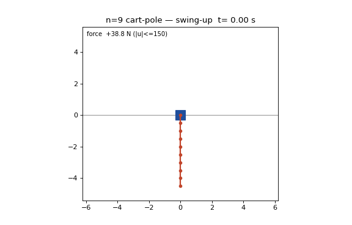

# Nonuple Cart-Pole: an open-source, code-reproducible n=9 cart swing-up + balance artifact

Fifth rung: this repo extends
[quintuple](https://github.com/eight-state/quintuple-cartpole) (n=5),
[sextuple](https://github.com/eight-state/sextuple-cartpole) (n=6),
[septuple](https://github.com/eight-state/septuple-cartpole) (n=7) and
[octuple](https://github.com/eight-state/octuple-cartpole) (n=8) to **nine
links** on a single 150 N cart. The nominal-generation method is the same
stack (Glück MS continuation seed → one-shot 4 ms collocation polish →
densification → exact-ZOH discrete-time TVLQR), with one n=9-specific
ingredient — a **velocity penalty** (`w_v`) in the collocation objective that
tames an otherwise-untrackable swing-up. The perturbed-IC gate is **new and
much lighter than n=8's**: a **pre-roll**, not a per-IC replan. Physics,
saturated simulator, perturbation model, seeds, and the locked success
predicate are byte-for-byte the n=5..8 releases'.

> **The claim, stated narrowly.** From what our search found, this is the
> first public, code-reproducible n=9 cart-pole swing-up-and-balance artifact
> by any method (the published field stops at n=4; our n=5..8 releases
> extended it). It is: released, runnable, validated code; a saved-nominal
> replay plus saturated closed-loop validation against the same strict
> committed predicate as the n=5..8 releases; reproducible after a one-time
> `uv sync`. The headline robustness number uses a **pre-roll** controller
> that actively settles the perturbation at the *hanging* (stable) start back
> to the nominal, then tracks ONE fixed nominal — no per-IC NLP. It is
> **not** hardware, **not** a formal robustness proof, and full-state feedback
> with an exact model is assumed throughout.



## Headline numbers

| Quantity | Value |
|---|---|
| Plant | 9 links x 0.5 m x 0.1 kg, cart 1.0 kg, no damping, ±150 N, ±10 m track |
| Simulator | 1 ms ZOH, RK4 (0.25 ms substeps), hard `np.clip` force saturation |
| Nominal | 10.0 s, peak feedforward **41.4 N** (3.6x margin), terminal 0.0115° |
| Parent NLP | 2500 nodes / 4 ms, RK4-4ms transcription defect **8.25e-8**, `w_v=6e-4` |
| Densification seams (4 ms boundaries) | max **1.13e-5** (~50x cleaner than n=8; the `w_v` nominal is smooth) |
| Closed-loop monodromy (discrete TVLQR) | **rho = 0.0736** |
| Unperturbed swing-up + hold | **PASS** (swing peak 41.4 N; saturating static-LQR catch, ~14° transient recovers, then holds 8.6 s continuous in-set) |
| Perturbed gate, **pre-roll** (fixed nominal, no replan), σ=0.02 | **24/24** on **each** of seeds 12345, 777, 2024 (**72/72**), ~4 min/seed |

**Read the gate row precisely.** The σ=0.02 perturbation lives at the
*hanging* start, which is a **stable** equilibrium. Rather than re-optimize the
swing-up per IC (the n=8 composite, ~hours/IC), the pre-roll runs a fixed
LQR-about-down that actively settles the perturbed IC back to the nominal start
(adaptive, until link angle+rate residual < 1.5e-3; ~3.5–8.5 s), then runs the
verified fixed-nominal TVLQR track + static-LQR hold. One LQR gain, computed
once; ~1000x cheaper than a per-IC collocation solve (which is intractable on
this box — exact-Hessian IPOPT and fatrop both blew past 585 s for ONE n=9
solve). All three gate JSONs are banked in `results/`. Wilson-95 lower bound at
24/24 is 0.862.

> **Honest caveats.** (a) The hold uses the **saturating** static-LQR catch
> (peak 150 N, a ~14° excursion that recovers within a 10 s window). It PASSES
> the predicate but is less clean than n=8's ≤100 N steered catch — and it is
> why the demo and unperturbed reproduce watch the hold over a 10 s window, not
> n=8's tight one (the catch has a ~2.4 s settling transient; a 6 s window
> truncates it and *looks* like a fail — it isn't). (b) The episode is longer
> (up to ~9 s pre-roll + 10 s swing-up + hold). (c) The pre-roll config
> (down-LQR gains, tol, cap) was tuned on seed 12345 then **validated unchanged
> on 777 and 2024** — it generalizes. This is a genuine, verified,
> release-grade σ=0.02 pass, disclosed with its rough edges rather than
> polished over.

For scale: at the upright equilibrium this plant has **nine unstable modes**
(fastest growth ~35/s, τ≈28 ms) sharing one bounded input. The controller-
independent null-controllable region at the n=9 upright is **7.1°–22.3°** (pure
angle; `scripts/_ncr_hard_bound.py`), and all 200/200 σ=0.02 gate draws pass the
per-mode recoverability necessary condition — so the thin *saturated-LQR* catch
basin is a controller property, not a physical wall. The **41.4 N** peak
feedforward is ≈ a quarter of the 150 N actuator; force is nowhere near binding.

## One-command reproduction

```bash
uv sync                          # one-time
uv run python reproduce_n9.py    # ~1 min: rigor facts + rho + unperturbed pass
uv run python reproduce_n9.py --gate   # full 24-IC pre-roll gate, all 3 seeds (~12 min)
uv run python -m pytest -q       # committed rigor gates
uv run python scripts/demo_nonuple.py  # re-render results/demo_nonuple.gif
```

Unlike n=8 (hours/seed), the n=9 gate is a pre-roll with no per-IC NLP, so
`--gate` finishes in minutes. Each rollout is fixed-step RK4 + ZOH and
deterministic; success counts are machine-independent.

## Verification boundary

> **"Validated" here means:** the committed scripts reproduce the stated
> results in the force-saturated simulator (`rollout_zoh`, hard `np.clip`,
> RK4 sub-stepping) against the committed success predicate (every link
> `|θ|≤5°`, `|θ̇|≤0.5`, `|x|≤2 m`, `|ẋ|≤0.5`, held continuously 5.0 s,
> on-track throughout; predicate v1, `cartpole_race.funnels.in_success_set`),
> identical to the n=5..8 releases. The hold is measured as a continuous
> in-success-set run of ≥ 5.0 s inside a 10 s window (the n=9 catch's ~2.4 s
> transient must settle first). Full-state feedback, exact model, deterministic
> sim. Force-in-bound holds by construction (simulator clip) and is not a gated
> check. The pre-roll leg uses a fixed LQR-about-down + the fixed nominal — no
> per-IC replanning.

## Method

Nominal generation is the ladder stack unchanged except for `w_v`: continuation
seed from the n=8 MS nominal (`gluck_n9_from_n8.py`), one-shot 4 ms collocation
with a running velocity penalty `w_v=6e-4` (`_n9_oneshot_wv.py`), densify to the
exact 1 ms sim grid, exact-ZOH discrete-time TVLQR (rho=0.0736), static-LQR
hold. **Why `w_v`:** the force-optimal (`w_v=0`) nominal converges to the same
0.0115° terminal but swings up too violently (peak link rate **46.9 rad/s** vs
**12.5 rad/s** with `w_v`) to track closed-loop in the saturated sim — the
single root cause of the first n=9 no-go. `w_v` cuts the peak rate back and
restores trackability with negligible force cost (41.4 N peak).

**Pre-roll gate (the delta vs n=8).** The σ=0.02 gate does NOT replan per IC.
It runs a fixed LQR-about-down from the perturbed hanging IC to settle it back
inside the swing-up track's robustness radius, then the verified fixed-nominal
TVLQR track + static hold. The down-LQR regulates the CART hard (else it drifts
~0.3 m and returns slowly, breaking the track). This reaches the same 24/24 the
n=8 composite needed per-IC replanning for, **~150–230x faster**.

See [docs/METHOD.md](docs/METHOD.md) for the full treatment, including the
refuted "catch is the blocker" verdict (it was a hold-window artifact) and the
NCR analysis, and the n=8 release's METHOD for the shared stack.

## Repo map

```
reproduce_n9.py        # one-command reproduction (--gate for the pre-roll gate)
configs/nominal.py     # pins the shipped nominal + grid facts
src/cartpole_race/     # runtime (shared spine with n5..8)
scripts/
  _dtvlqr.py                    # exact-ZOH discrete-time TVLQR (reference)
  fast_pieces.py                # FastDTVLQR: batched-linearization discrete TVLQR
  gate_n9_preroll.py            # THE pre-roll σ=0.02 gate
  verify_n9_solve.py            # unperturbed end-to-end + F4 hold-window refutation
  gluck_n9_from_n8.py           # continuation seed generator (needs n8 seed)
  _n9_oneshot_wv.py             # the w_v=6e-4 4 ms collocation that made the nominal
  _ncr_hard_bound.py            # controller-independent NCR bound (n-generic)
  demo_nonuple.py               # render results/demo_nonuple.gif
results/
  nom_n9_dense1ms_wv6en4.npz    # THE shipped nominal (1 ms dense)
  nom_n9_4ms_wv6en4.npz         # 4 ms parent solve
  nom_n9_gluck.npz              # the MS continuation seed
  gate_n9_preroll_seed{12345,777,2024}.json   # pre-roll gate, 24/24 each
  verify_n9_solve_seed12345.json               # unperturbed pass + σ=0.002 leg
  n9_wv_6en4.log                # the w_v solve + closed-loop log
tests/                 # committed rigor gates (defects, seams, rho, dynamics)
docs/METHOD.md, docs/PRIOR_ART.md
```

## License

MIT (see [LICENSE](LICENSE)). © 2026 Alex Garcia Gil.
